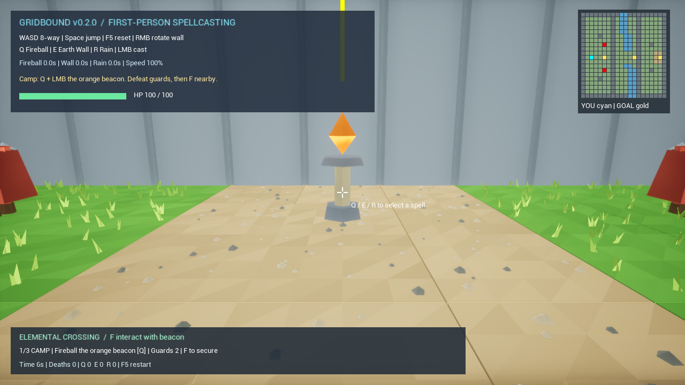
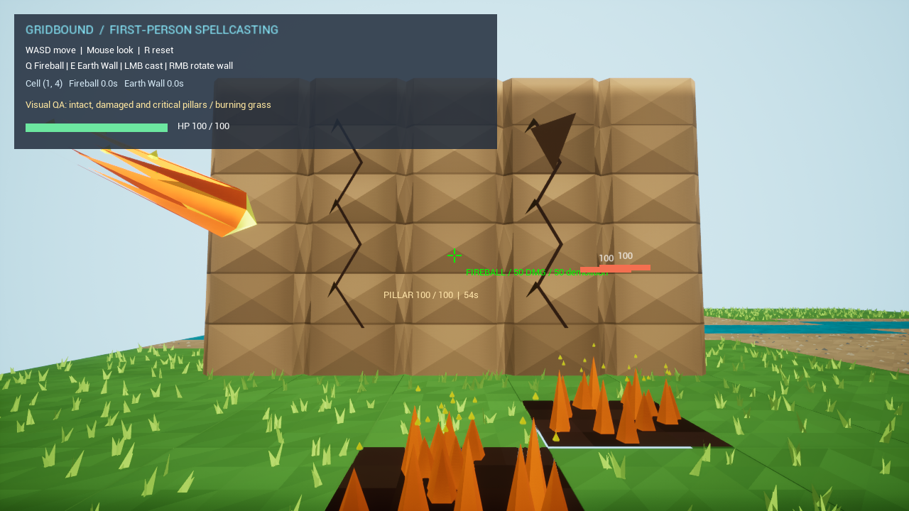

# Gridbound

**第一人称格子战斗 Demo · Unreal Engine 5.8.2 · C++ · Windows**

用火球点燃草地，用降雨灭火并制造泥地，用土墙改变地形、托举人物或阻挡追击。Gridbound 将实时第一人称施法与格子移动结合，探索技能、可破坏环境和敌人 AI 之间的交互。

**[下载 Windows 试玩版](https://github.com/yojillkl/Gridbound/releases/latest) · [源代码](Source/Gridbound) · [开发记录](Docs/DevelopmentNotes.md)**

> 招聘官快速体验：下载 Release 中的 `Gridbound-Windows-v0.2.0.zip`，完整解压，双击 `Play-Gridbound.cmd`。无需安装 Unreal Editor。此仓库主页展示项目与代码，试玩版为 Windows 下载运行形式。



*v0.2.0 实际开局：营地信标、分段地形、目标栏与小地图。*

## 元素渡口关卡 v0.2.0

默认进入三段关卡：**营地 → 燃烧渡口 → 高台**。先清除本区域守卫并满足信标条件，再靠近按 **F** 推进；底部目标栏和右上角小地图提供方向。

1. **营地**：用 Q 火球命中橙色信标，击败两名守卫，靠近按 F。入口允许先阅读提示。
2. **渡口**：用 R 降雨覆盖蓝色信标及燃烧草桥，利用泥地和土墙处理三名守卫，靠近按 F。
3. **高台**：击败四名守卫，在平台旁用 E 土墙抬升自己，走落到灰色平台，靠近绿色信标按 F 完成关卡。

新增永久岩体、不可直接步行穿越的水道、分段关口、检查点和通关统计。敌人具备局部巡逻、视线警戒、近处同伴响应、避火、泥地与拆墙代价寻路，以及 0.45 秒劈砍预警；离开橙色预警格可躲避攻击。

[关卡策划案](Docs/LevelDesign.md)包含布局、技能联动、敌人规则和验收标准。使用 `-GridboundSandbox` 启动参数可进入原无限练习场。
## 试玩方式

1. 从 [Releases](https://github.com/yojillkl/Gridbound/releases/latest) 下载 Windows ZIP，**先解压整个文件夹**。
2. 双击 `Play-Gridbound.cmd`（或 `Gridbound.exe`）。如果缺少运行库，安装包内 `Engine/Extras/Redist/en-us/vc_redist.x64.exe` 后重试。
3. 移动并观察战士的追击；选择技能后点击左键施放。F5 重置场地，Alt+F4 退出。

运行环境：Windows 10/11 64 位、支持 DirectX 12 的显卡。硬件最低配置尚未进行跨设备测定。

### 操作

| 按键 | 功能 |
|---|---|
| WASD / 鼠标 | 相机相对八方向移动 / 第一人称观察 |
| 空格 | 跳跃，高度 145 cm，平地滞空约 0.82 秒 |
| Q / E / R | 选择火球术 / 土墙术 / 降雨术 |
| 鼠标左键 | 施放选中的技能 |
| 鼠标右键 | 土墙在 1×5 和 5×1 之间旋转 |
| F | 靠近当前信标交互 |
| F5 | 重置关卡、人物、敌人、技能与场地 |
| Alt+F4 | 退出试玩 |

### 两分钟体验路线

- **火球与草地**：Q 后左键发射直线火球；命中人物扣血，命中草地点燃地面。
- **雨与泥地**：R 后瞄准燃烧草地或砂石地，左键降雨；火焰熄灭并形成减速泥地。
- **墙与托举**：E 后向脚下或敌人脚下施法，体验土墙升起；右键可切换方向。
- **破坏与 AI**：火球拆掉单根土柱；战士会追击、绕墙，无法绕行时劈砍拆墙。玩家死亡后在检查点重生，清除守卫并激活信标推进关卡。

## 核心系统

| 系统 | 当前实现 |
|---|---|
| 火球术 | 直线弹道与扫掠碰撞；50 人物伤害、50 拆毁值；命中首个目标即停止 |
| 土墙术 | 每根柱独立 100 耐久、持续 60 秒；1×5 / 5×1、高 3 格；范围 10 格，逐格跳过阻碍，升墙托举人物 |
| 燃烧 | 草地燃烧 10 秒，对接触地面的人物造成 10 HP/s；刷新持续时间，不叠加伤害 |
| 降雨与泥地 | 半径 4 格的离散圆，共 49 格；灭火、泥地减速 50%，60 秒后恢复原地形 |
| 敌方战士 | 100 HP；网格寻路、绕墙及拆墙；劈砍冷却 1 秒，20 伤害、10 拆毁值 |
| 重生 | 玩家 100 HP，死亡 2 秒后重生；关卡采用有限遭遇；练习场清场后补充 1 名战士；出生点被占用时寻找附近安全格 |
| 移动 | 八方向格子步进，斜向等速，禁止切墙角；60 ms 起步组合键窗口，移动与跳跃并行 |
| 美术 | 程序化低多边形地形、角色、火球、受损土柱、燃烧、雨和泥地 |



*技能展示截图：完整、受损及重损土柱与燃烧草地。*

## 代码导览

| 文件 | 职责 |
|---|---|
| [GridGame.h / .cpp](Source/Gridbound/GridGame.cpp) | 输入、镜头、HUD、火球、场地与技能协调 |
| [GridMovement.cpp](Source/Gridbound/GridMovement.cpp) | 组合键处理、八方向移动、跳跃入口和阻挡判定 |
| [GridEnvironment.cpp](Source/Gridbound/GridEnvironment.cpp) | 独立耐久、燃烧计时、托举及下落 |
| [GridRain.cpp](Source/Gridbound/GridRain.cpp) | 降雨范围、灭火、泥地状态、地形恢复、土墙裁剪 |
| [GridWarrior.cpp](Source/Gridbound/GridWarrior.cpp) | 战士寻路、近战、出生与重生 |
| [GridArt.cpp](Source/Gridbound/GridArt.cpp) | 运行时程序化网格与效果美术 |

关键设计：人物 HP 与物品耐久独立；技能效果通过地形状态交互；逻辑格与物理位置共同参与移动、落点和支撑判定。开发过程中使用 AI 辅助实现与验证。

## 从源码运行

需要 Unreal Engine **5.8.2**、Visual Studio C++ 工具链及 Windows SDK。

```powershell
# 替换为本机 Unreal Engine 安装目录
./Scripts/Build.ps1 -EnginePath 'D:\Epic Games\UE_5.8'
./Scripts/Play.ps1 -EnginePath 'D:\Epic Games\UE_5.8'

# 生成可分发的 Windows 试玩包
./Scripts/Package.ps1 -EnginePath 'D:\Epic Games\UE_5.8'
```

也可打开 `Gridbound.uproject`，进入 `Content/Maps/GridArena` 后点击 Play。仓库包含项目源码、地图与材质，不包含引擎源码、缓存或本机编译产物。
